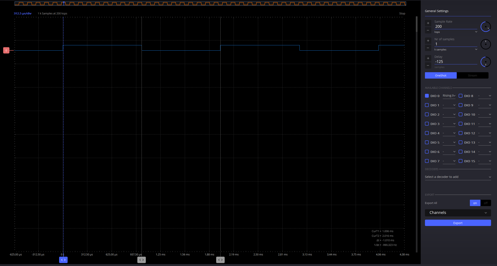
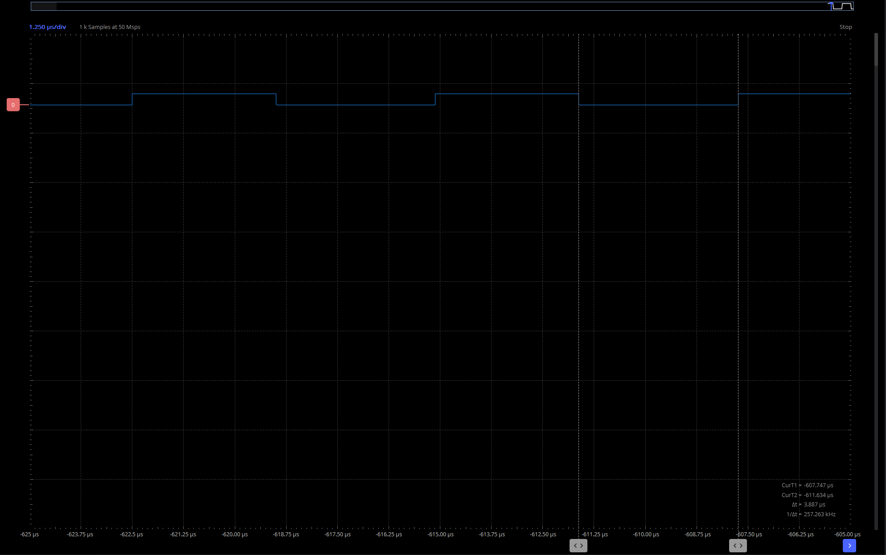
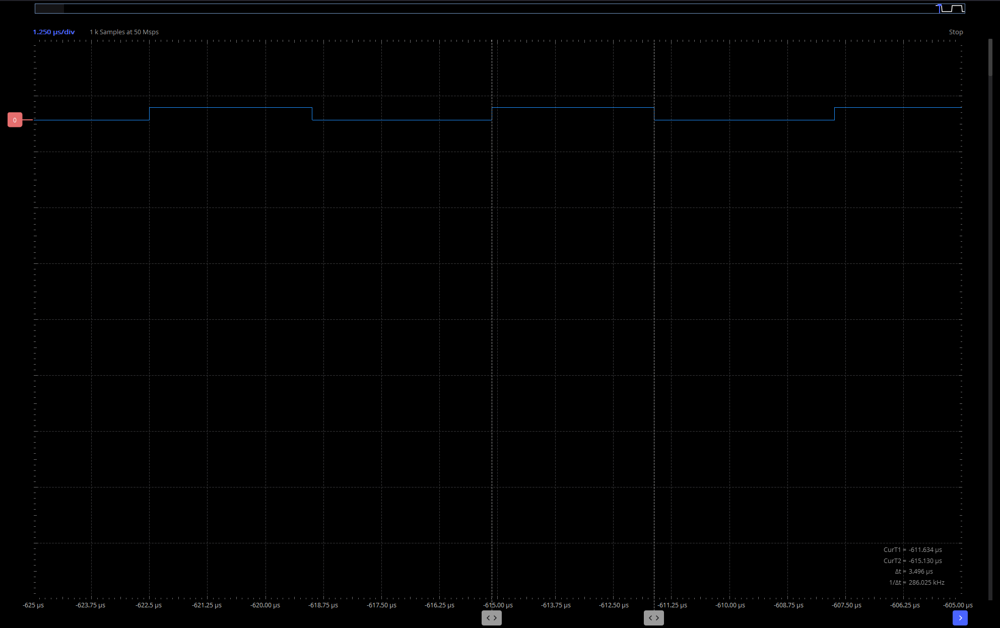
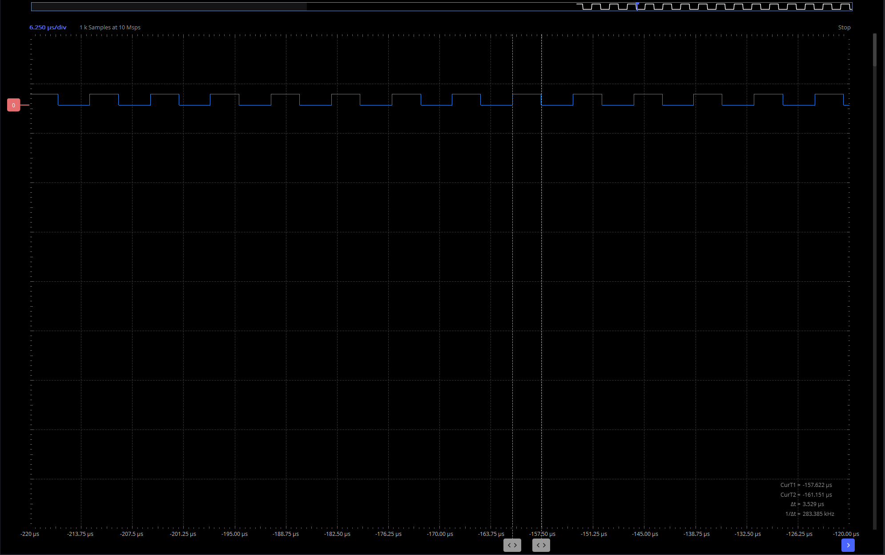
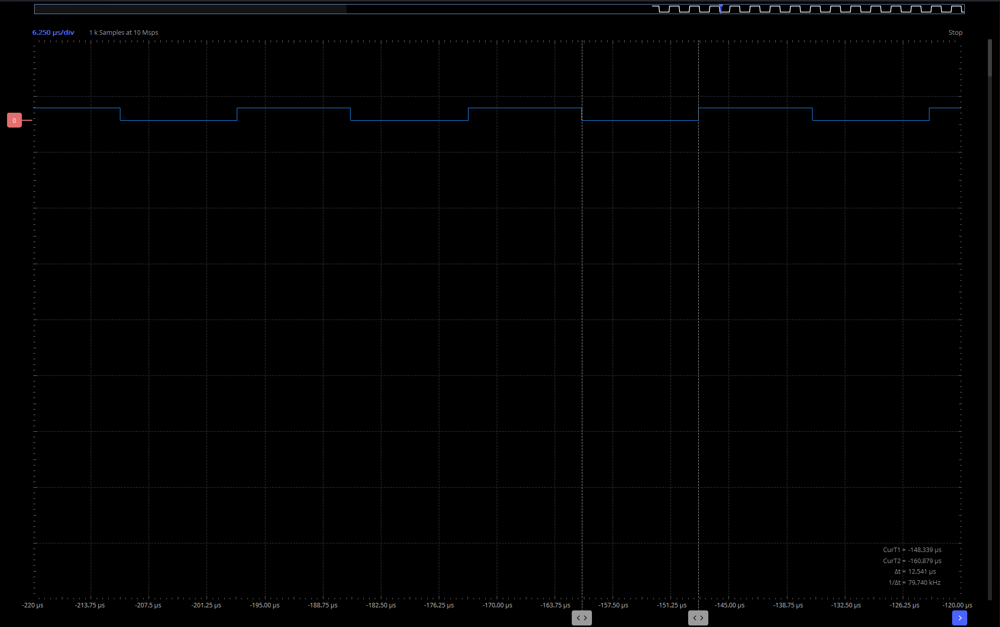
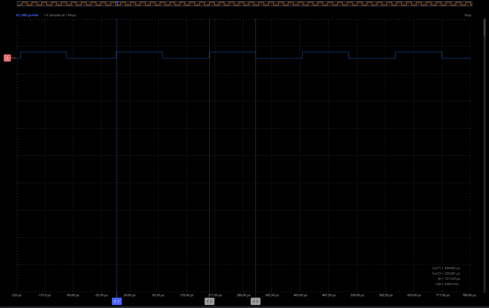
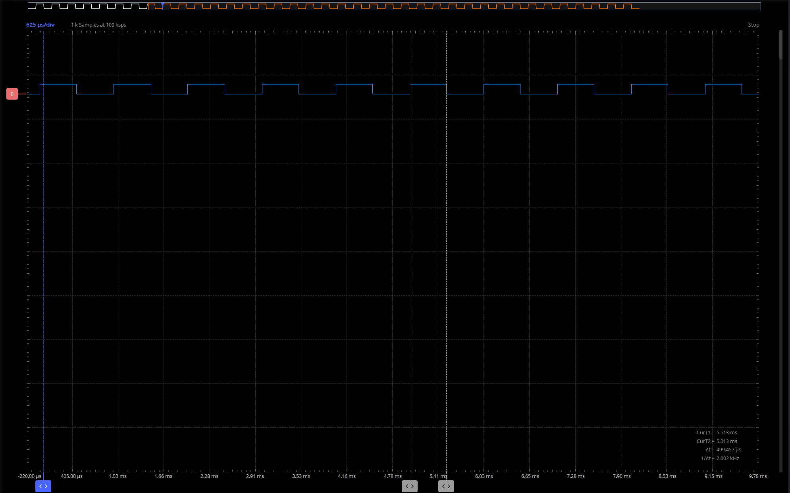

# Project 3: Measuring minimum delay in Arduino using the ADALM2000 logic analyzer

1. Understand the use of variables in code
2. Learn how to use a logic analyzer
3. Understand the concept of overhead and measure it

## resources
[Arduino Functions Reference](https://www.arduino.cc/reference/en/)

## Change Blink.ino code
 - Save Blink example as BlinkWithVariableDelay.ino in this folder
 - Use a variable to change built in led (13) to grove led (4)
 - Use a variable to change delay to 1 ms 
 - upload to arduino
 - can you see the led blink? Why? no since we are not sensitive enough to see the 1ms blinks

## Use logic analyzer to see and measure the blink
 - connect ADALM2000 to grove kit: 
    - gnd in ADALM to GND in arduino (black color is used as a standard for GND)
    - digital pin 0 (solid pink) to pin13 in arduino (why?)
 - open scopy program
 - connect to ADALM2000
 - open scopy logic analyzer
 - activate DIO0 and rising edge and run (why?)
 - play with the scopy parameters until you can see the separate blinks. Which parameter(s) do you need to change?
 - use cursors and sample rate to measure the pulse width
 - take screenshots and add them to the README below.
 

## Measure overhead
 - Remove the delay statements and upload the code
 - Measure pulse width. What is the minimum time that the signal is HIGH and LOW? this is the overhead.
 the overhead of on high is 3.8 microseconds
 the over head of the low is 3.5 microseconds
 - Take screenshots and add them to the README below.
 

## even shorter blink
- delay() is limited to 1 ms. Find a function that delays 1 microsecond. 
 - Try different delays and measure the overhead.
 - Take screenshots and add them to the README below.
for 1 microsecond i got the same overhead as previously described

for 10 microsecond i got over head of 12.541 microsecond

for 100 microsecond i got overhead of 101.52 microsecond
 
for 500 microsecond i got overhead of 499.46 microsecond

## Git
 - Commit the new README with your screenshots
 - push to your repo.

## Exercise
Paste screenshots below.

