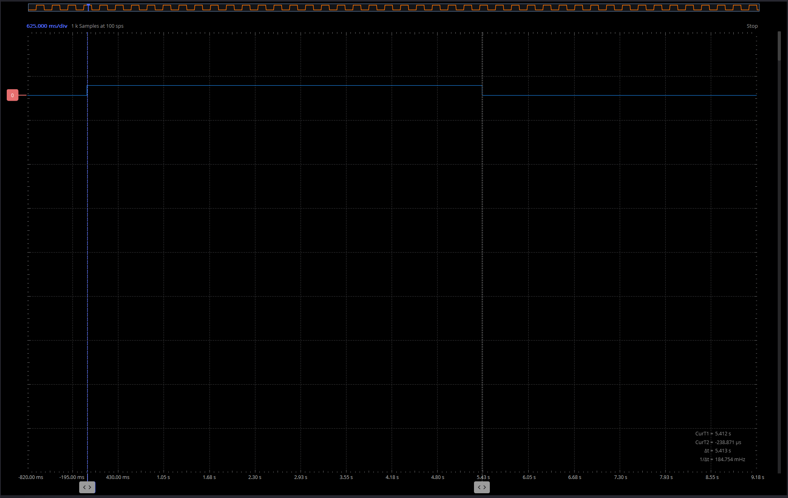
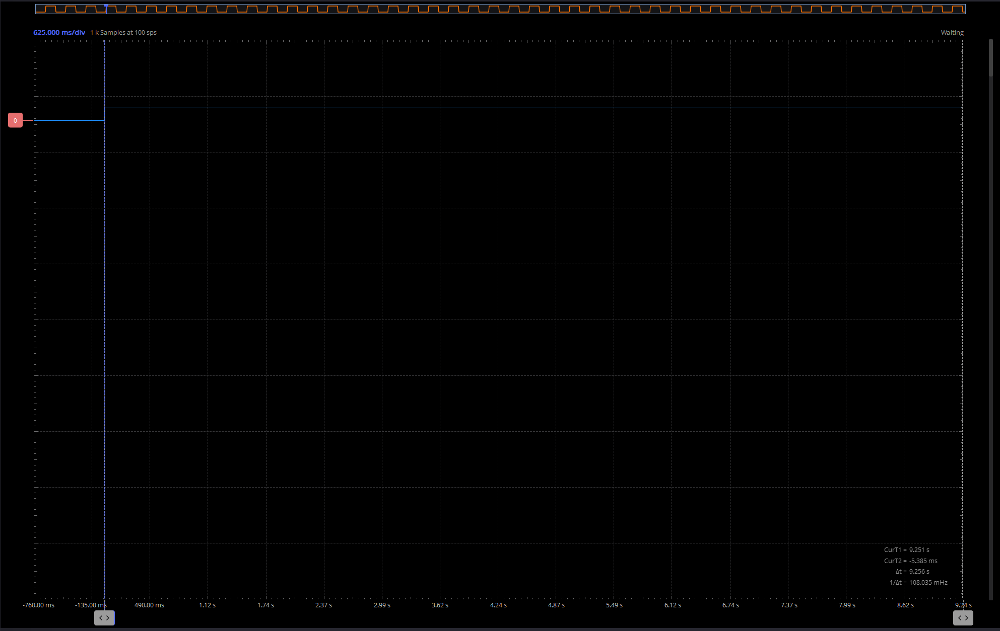
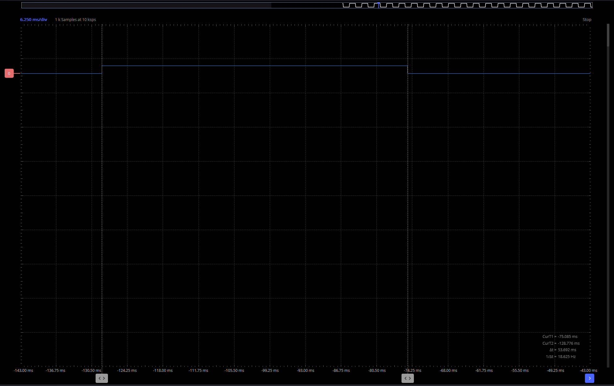

# Project 6: LED turns ON for 5 seconds on button press - the use of timers in Arduino

1. Understand the use of timers in Arduino and problems that they can solve

## Write a program that does the following:
- Turn on an LED on pin 4 when a button is pressed using interrupts
- The LED should turn off after 5 seconds
- Do not use a delay() function here. Please use the system clock to measure the time. look for the millis() function in the Arduino reference.
Test the code and make sure it works as expected
paste a screen shot from the logic analyzer below:
 
## update the code to add a delay in the loop function
- Add the same for loop as in the previous exercise to simulate a long process. Does the LED still turn off after 5 seconds? Why or why not?
answer here: No the LED dos not go off since we wil recheck everything only when the loop is doe and the calculations will be over.
add a screen shot from the logic analyzer below:

## Write a second program. The proper way to solve this problem is to use a timer
- install package mstimer2 from the library manager
- read the readme file of the package and note the package limitations
- open an example of the package, examine the code and its functions and how to use them.
- implement a timer to turn off the LED after 5 seconds
- note the callback in the timer. When is it called?
the call back is to turn off the light and it called when the timer is done.
## Exercises
- check that although the delay of 1 second is still in the loop function, the LED now turns off after 5 seconds

- change the LED time ON from 5 seconds to 30 ms, measure in the scope the time the LED is ON. is it 30 ms? Why or why not?
answer here: its close but not since there is a bit of latancy from the moment we set and start the timer and also from the moment it goes to the function thes all result in 170microseconds og latancy 
paste a screen shot from the scope below:
