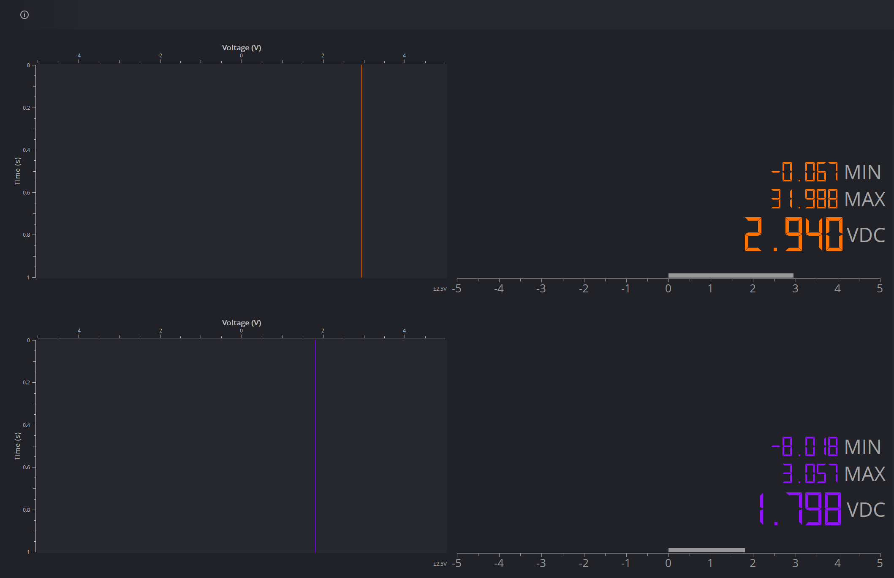
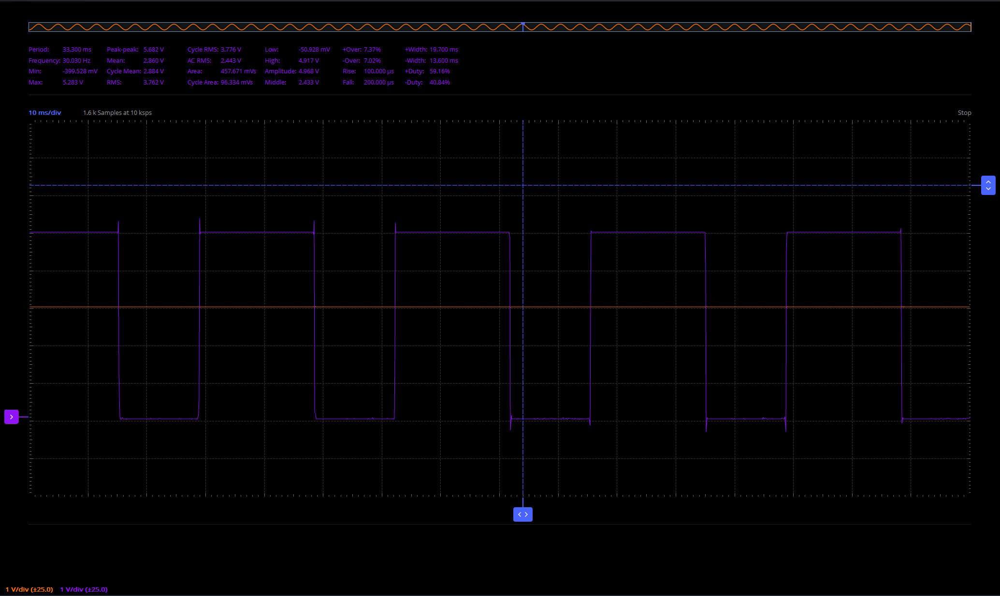
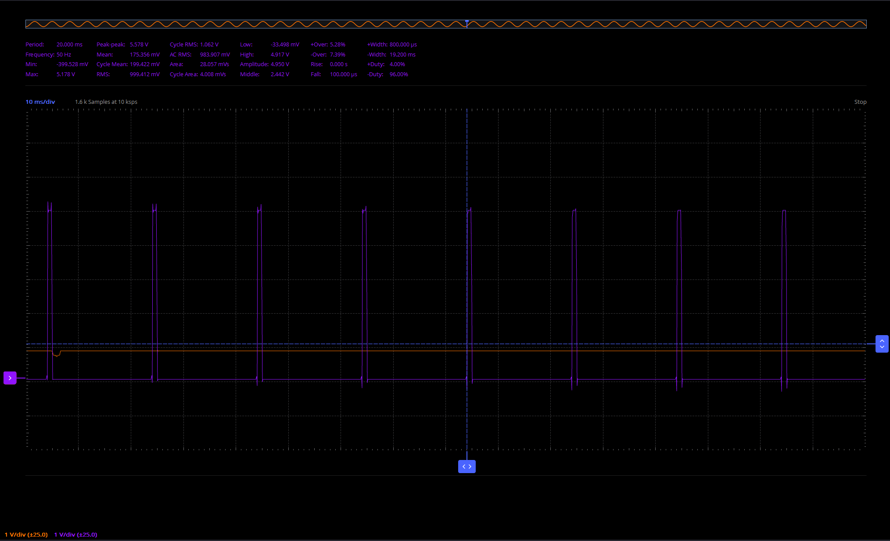

# Project7 - Analog!

1. Understand the difference between analog and digital signals
1. Learn to use a voltmeter and scope
1. Measure analog signals
1. Understand PWM and when to use it
1. Learn about MD_PWM package
1. Learn about servo motors
1. Understand arduino signal capabilities

## Adding a dimmer functionality to the LED

The purpose of this project is to dim and increase the led light using the rotary button.

- rotary is A0 in Arduino. connect gnd (in arduino) first to orange with stripe (in ADALM) and then A0 to orange.
- Use voltmeter in Scopy to see range of values when turning the rotary. (you will need to create an Arduino file for this)
- pin 4 (grove LED) is not supported for PWM. Install package MD_PWM, and set pin 4 to be PWM using the package documentation.
- Using the rotary value, update the PWM value. Note the range of values that can be used according to package documentation. Change your code accordingly.
- test your code.
- View in scope: Connect Analog 2 (dark blue) to pin 4 in arduino (LED output). Play with the times and triggers until you see the PWM change when turning the rotary.
- View in voltmeter - stop scope first. See the average voltage change. What is the duty cycle? the duty cycle is 60% when the rotary values are 609

- what happens when using 30Hz instead of 50Hz for the PWM? the cycles became longer and the leds flashing is visble now but the duty of the cycle didnt change meaning the led is on 60% of the time.

## Use PWM to control a servo motor

- connect analog 2 in adalm (dark blue) to digital 7 in arduino
- install Servo package if not already installed
- initialize Servo package with pin 7
- first check in adalm the range of the mapped values. What frequency is the Servo package using? the frequency used in the Servo package is 50Hrz with values ranging from 1 to 180

- connect to servo using D7 breakout (ground on the left on the side of the led). connect plus to servo
- turn rotary to turn the servo
- How does the range of the servo motor compare to the range of the rotary? Use the scope.
while looking at therotary we map the 1024 to 180 degrees but even then the servo woudnt be using the minimal and the full duty cycle were those would range from 3% to 12%.
- is the range of our servo the same as the range of the package? change the range of values to the servo accordingly.
so the package states that the servo should have 180 degrees in practice we have only 170 degrees of movement.
## Exercises

- commit and push both .ino files and their folders to your repository

