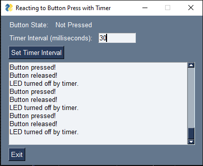
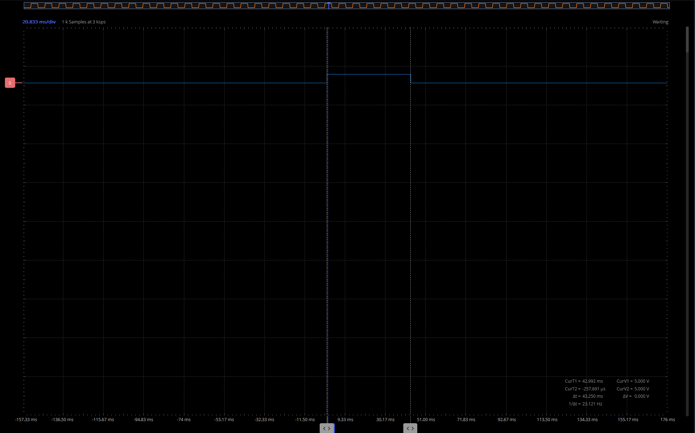

# Project8.1 - Two way communication between the computer and the Arduino board using firmataexpress

## Goals
1. Understand the firmataexpress package and its usage in actual project
2. Understand the use of jupyter notebooks for exploration

## Instructions
1. Install the firmataexpress package in the Arduino IDE. upload the firmataexpress sketch to the Arduino board.
2. Install the [pymata4 package](https://mryslab.github.io/pymata4/install_pymata4/) in the python environment - pip install pymata4 
3. follow along with the jupyter notebook.

**IMPORTANT!** the pymata4 package sometimes causes crashes. The computers reset when booting and all your code will be lost in this case. Therefore, **commit and push often**.

## Requirements

1. Develop a Python script that communicates with an Arduino device using the pymata4 library.
2. Set up a pin for digital input and monitor its changes.
3. React to button presses on the Arduino. When the button is pressed, perform an action (e.g., print a message, turn on an LED).
5. use threading.Timer (from the threading python package) to turn off the led. This will allow the script to perform other tasks while waiting for the button press. This version of the script should be named Reacting_button_press_pymata4_using_timer.py.
6. Add a Graphical User Interface (GUI) to the timer version of the script. The GUI should display the state of the button (pressed or not pressed) and any actions performed in response to the button press. plus, it should have a textbox input to accept different time intervals for the timer.
7. light the led for 30 ms. Measure in scopy the length of the led light a 5-10 times and measure the average and standard deviation. Compare to previous arduino and non firmata python code.
in this version the aveage time was 40.577ms with 6.74ms STD which are more than the 30ms reactions we got from previous versions 
8. Include comments explaining the functionality of each part of the code.
9. Write the script in a clean, organized, and efficient manner following good programming practices.


## Exercises
Paste a screenshot of the GUI here:


Paste a screenshot of the logic analyzer here that presents the time the LED is ON when pressing the button.

```
What is the difference between the two versions (with pymata4 and firmata and without) of the script? Which one was easier to code? Where was thread handling easier?

Answer: the difference between the two versions that in the pymata we control the arduino with the python itself and the code that loaded on it is only to enable the control. the previous version we loaded a code that performed all we wanted and only communicated with the python. in the pymata the threading was easier since I dont have to read the monitor all the time to acctually interact with the device.


What can you say about the accuracy of the timing between the firmata version and your arduino code version?
which one is more accurate and why?

the arduino version is more accurate where the pymata version had inconsistent latency. the reason is that the arduino version runs on the arduino and only comunicates to the computer where the pymata version the signal passes through the computer and then the led lights. the more accurate version is the arduino one.

What are the advantages and disadvantages of using the pymata4 package?

Answer: it is very easy and user friendly to use once you have the arduino side ready. the disadvantage is that there is latency and can cause inaccuracy in delicate systems.